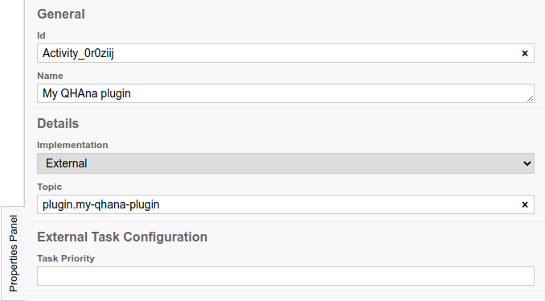
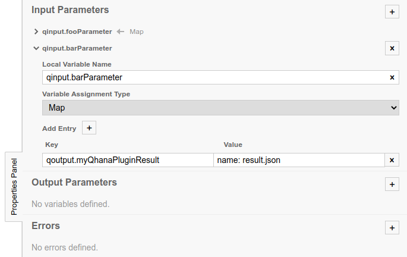

# Workflow plugin for BPMN and Camunda
Plugin: workflows@v0.5.1 ([changelog](#changelog))


## Prerequisites

Python >= 3.9

Celery beat is required in order to run workflow instances and can be started together with the worker with the
`--periodic-scheduler` flag.
For more information see the readme file of the qhana-plugin-runner.


Additionally, [Camunda](https://camunda.com/) BPMN run is needed.

It is recommended to use celery workers with a non-solo pool, e.g., gevent or eventlet.
Set the concurrency flag to allow for multiple celery task instances.

Example with pool, concurrency and celery beat:

```bash
# Run worker
poetry run invoke worker --pool=gevent  --concurrency=10 --periodic-scheduler
```

To model workflows and deploy them you need the [Camunda Modeler](https://camunda.com/download/modeler/).

## Creating workflows

### Service Tasks

QHAna plugins (and plugin steps) are represented as Service Tasks in the modeler.
Note: You can choose the name of the service task freely.


### Linking Plugin Tasks

In order for the workflow plugin to know which QHAna plugin should be called when a
token reaches the service task, set the Implementation option of the service task
to `External` and the topic to `plugin.name`, where `plugin.` is the prefix and `name`
the name of the plugin.



### Linking Plugin Step Tasks

Plugin step tasks must be in a topic starting with `plugin-step.`. After the dot
follows a workflow variable name that contains the step information.

### Plugin Output

It is possible to assign a variable to the output of a QHAna plugin. To do this,
add an entry to the Output Parameters option of the service task. In the Process
Variable Name field you can specify the variable name as `qoutput.name`, where
`qoutput.` is the prefix and `name` can be any name that is unused. The process
variable name is used to map output to input. 

The varibale assignment type should be set to `String or Expression` and the
variable assignment value field to `${output}`.

Note: The variable will contain all results of the plugin. The [Inputs](#inputs)
section discusses how to select a specific result as input.


If the plugin needs additional user inputs (i.e. when a new uncleared step is added
to the steps list of the plugin result) the external task will complete with that
added step as output instead. Every step of a multi-step plugin invocation must be
modeled as an individual external task. 

### Plugin Inputs

A QHAna plugin may have one or more inputs. To define inputs in the Camunda
modeler, add an entry to the Input Parameters option of the service task.
In case you want to use the output of a QHAna plugin as an input, set the 
Local Variable Name field to `qinput.name` where `qinput.` is
the prefix and `name` corresponds to the plugin input parameter name.

Additionally, you may use any variable from the BPMN workflow as input, therefore
the Local Variable Name should be set to `variable_name`, the name of the variable.

The Variable Assignment Type should be set to `Map`. To map an output to the input
add an entry. The `Key` should be set to the variable name of the output (See 
[Output](#output) section for details). There are different options to set
the `Value` field:

- `name: output.txt` - With `name` you can select the result by the name property 
from a QHAna output
- `dataType: wu-palmer-cache` - With `dataType` you can select the result by the data
type property from a QHAna output
- `plain` - Use this option if the input is not from the output of a QHAna 
plugin.

You can add multiple inputs to the Input Parameters option of the service task.




### Workflow outputs

To mark a variable as workflow output add the prefix `return.`. 

Example:

- `qoutput.someVariable` to `return.qoutput.someVariable`
- `myVariable` to `return.myVariable`


### Human Tasks / Workflow Inputs

For a workflow inputs from Human Tasks may be required. It is
possible to create a form within the Camunda Modeler that will be displayed
in QHAna to receive the required inputs.

First, add a user task in the Camunda Modeler.


Within the `Forms` Tab of the user task leave the `Type` to `<none>`. For every
required input add an entry to the `Form Fields` option. 

Set the `ID` to the variable name which will be used in the workflow. The `Type`
option should be set to `string`. 

The `Label` can be set to any value. The label is placed above the text box for the 
input in a QHAna form. `Default Value` is used for the text box for
the input. Both can be left empty, but it is recommended to use the label.

To display a select field within a QHAna form add the prefix `choice::` to the 
`Default Value` field.
Example: `choice:: typeA, typeB, typeC`.

Other form field types: `enum, file_url`


### Exceptions

Service Tasks representing QHAna plugins may throw BPMN exceptions. For this
an error boundary event is added to the service task.


Currently, following exception error codes are supported:

- qhana-unknown-error: An unknown exception occured
- qhana-unprocessable-task-definition-error: The task definition in the workflow could not be processed (e.g. because the topic name was malformed)
- qhana-unprocessable-entity-error: The plugin rejected the inputs as unprocessable
- qhana-plugin-not-found-error: The plugin was not found in the plugin registry
- qhana-unprocessable-plugin-result-error: There was some (technical) error with the result endpoint of the plugin invocation
- qhana-plugin-failure: The plugin result indicates a failure condition

### Example Workflows

You can find examples in the `/bpmn` directory of the workflows plugin to get started.

## Deploying Workflows

Open the workflow in Camunda Modeler.
This can be your own workflow or one the example workflows.
- click on the rocket icon at the bottom
- enter a deployment name
- set the REST endpoint to the endpoint of Camunda BPMN
  - if you're using the docker setup this would be http://localhost:5018/engine-rest

You can open the Camunda Cockpit in your Browser to see the deployed workflows.
If you're using the docker setup the URL is http://localhost:5018/, username: `demo` and password: `demo`.
Click on the number below `Deployments` or at the top bar on `more` -> `Deployments` to see the deployed workflows.

## Changelog

### v0.6.0
- Refactor sourcecode
- Add better error handling
- Refactor long blocking tasks into repeatable tasks
- Add support for multi step plugins

### v0.5.0
- Preview BPMN diagrams with bpmn.io when completing human tasks
- Extended form field types with enum and file

### v0.4.0
- Support select form fields for QHAna forms

### v0.3.0
- Mark workflow variables as workflow output
- Plugin now terminates with a list of workflow output variables

### v0.2.0

- Use Celery tasks instead of threads
- Added invoke beat command to poetry
